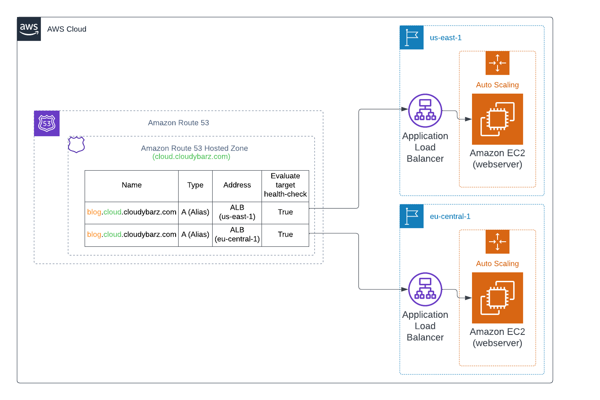

# Latency-based routing solution with Python and AWS CDK

<br><br>

## Description
This is a simple project showing how to create complete latency-based routing infrastructure in Amazon Route 53 using AWS CDK and Python.

## Prerequisite
 * AWS CDK CLI
 * AWS CLI
 * node.js
 * Python 3.12
 * Poetry

## Quick start
1. Clone the repo
   ```sh
   git clone https://github.com/sz3jdii/latency-based-routing-infrastructure.git
   ```
2. Install dependencies
    ```sh
    poetry install
    ```
3. Set your main's SSO region in [constants.py](./cdk/latency_based_routing/constants.py)
    ```python
    MASTER_REGION: Final[str] = 'eu-central-1'
    ```   
4. Deploy the hosted zone
   ```sh
   ./deploy.sh --region eu-central-1
   ```
5. Deploy the Webserver (main-region)
   ```sh
   ./deploy.sh --region eu-central-1
   ```
6. Deploy the Webserver (secondary-region)
   ```sh
   ./deploy.sh --region us-east-1
   ```

## Useful commands
 * `./lint.sh`          Fixes indents and checks your code quality
 * `./destroy.sh --region us-east-1`       Triggers cdk destroy
 * `./deploy/sh --region us-east-1`        Deploys stack to the AWS account
 * `pytest -vv ./tests` Run tests

## Useful links
* [AWS CDK](https://docs.aws.amazon.com/cdk/v2/guide/cli.html)

## Author
**Adam Świątkowski**
* [github/sz3jdii](https://github.com/sz3jdii)
* [Blog](https://cloudybarz.com/)

### License
Copyright © 2024, [Adam Świątkowski](https://github.com/sz3jdii).
Released under the [MIT License](LICENSE).

